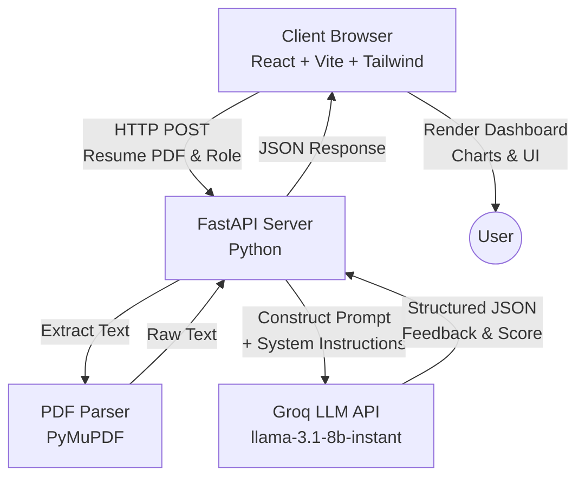
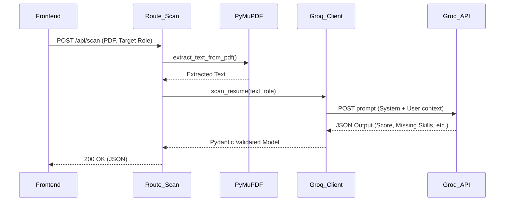
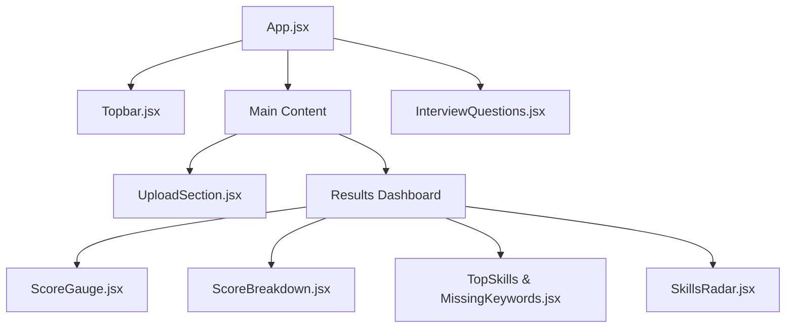

# Project Report: AI Resume Scanner & Interview Coach

## 1. Abstract
The **AI Resume Scanner & Interview Coach** is a modern, full-stack web application designed to help job seekers optimize their resumes for Applicant Tracking Systems (ATS) and prepare for job interviews. By leveraging advanced Large Language Models (LLMs) via the Groq API, the platform provides real-time, actionable feedback, skill gap analysis, and interactive mock interviews tailored to specific job roles.

---

## 2. High-Level Design (HLD)
The High-Level Architecture follows a standard client-server model with an external AI service integration.

### Components:
- **Frontend Client:** A responsive React application that handles file uploads, renders data visualizations (via Recharts), and manages the state of the mock interview.
- **Backend API:** A fast, asynchronous FastAPI Python server that acts as the orchestration layer between the user and the AI.
- **AI Engine:** Groq's high-speed inference engine running Llama-3, strictly prompted to return structured JSON data.

---

## 3. Low-Level Design (LLD)
The Low-Level Design details the internal routing and service functions within the FastAPI backend and the component hierarchy of the frontend.

### Backend Application Flow

### Frontend Component Tree

---

## 4. Technology Stack Detail

### Frontend
- **React 18:** Functional components with Hooks (`useState`, `useEffect`) for state management.
- **Tailwind CSS:** Utility-first styling for rapid UI development, featuring glassmorphism and modern gradients.
- **Vite:** Next-generation frontend tooling for ultra-fast Hot Module Replacement (HMR).
- **Recharts:** Composable charting library to render the Skills Radar and Score Breakdown.
- **Framer Motion:** Declarative animations for smooth component mount/unmount transitions.

### Backend
- **FastAPI:** High-performance web framework for building APIs with Python 3.8+ based on standard Python type hints.
- **PyMuPDF (fitz):** Fast PDF processing library to extract readable text from complex resume layouts.
- **Pydantic:** Data validation and settings management using Python type annotations. Ensures the LLM's JSON output matches our expected schema.
- **Groq Python SDK:** Client to interface with Groq's ultra-low-latency Llama-3 API.

---

## 5. Core API Endpoints

### `POST /api/scan`
- **Purpose:** Analyzes the uploaded resume against the target role.
- **Payload:** `multipart/form-data` containing the PDF file and target role string.
- **Response Structure:**
  - Overall ATS Score (0-100)
  - Formatting, Keywords, and Impact sub-scores
  - Top identified skills
  - Missing crucial skills
  - Recommended interview questions

### `POST /api/interview/evaluate`
- **Purpose:** Evaluates a user's answer to an AI-generated mock interview question.
- **Payload:** Question text, user answer, target role.
- **Response Structure:**
  - Answer Score (0-10)
  - Constructive feedback
  - Ideal talking points missed by the user.

---

## 6. Conclusion
The AI Resume Scanner successfully combines modern web development practices with cutting-edge LLM technology. By delegating heavy natural language processing to the Groq API and enforcing strict schema validation on the backend, the application remains lightweight, highly scalable, and incredibly fast.
