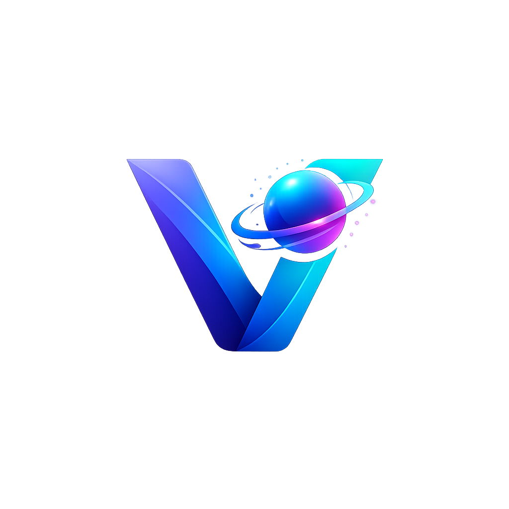

  

  # 🚀 AI Resume Scanner & Interview Coach

  **An intelligent, Groq-powered platform designed to analyze resumes, score them against target roles, and provide interactive mock interview preparation.**

  
  
  
  
  

  [Features](#sparkles-features) • [Tech Stack](#gear-tech-stack) • [Getting Started](./SETUP.md) • [Documentation](./DOCS.md)

---

## 🌟 Overview

The **AI Resume Scanner** bridges the gap between job seekers and their dream roles. By leveraging ultra-fast LLMs through Groq's API, the platform provides immediate, actionable feedback on resumes. 

Whether you're aiming for a DevOps role, a Full-Stack position, or an AI Engineering job, this tool acts as your personal ATS (Applicant Tracking System) simulator and interview coach.

## ✨ Features

- 📄 **Smart PDF Parsing:** Upload your resume, and our backend extracts and processes the text using `PyMuPDF`.
- 🎯 **ATS Scoring & Analysis:** Get an overall ATS score, role match percentage, and a breakdown of formatting, keywords, and impact.
- 💡 **Actionable Feedback:** Receive specific suggestions on what to improve, what keywords are missing, and top skills identified.
- 🎤 **Interactive Mock Interviews:** Based on your resume and target role, the AI generates technical and behavioral questions. Answer them and get immediate AI evaluation and feedback!
- 🎨 **Beautiful UI/UX:** Built with React, Framer Motion, and Tailwind CSS for a premium, glassmorphism-inspired aesthetic.

## ⚙️ Tech Stack

### Frontend (User Interface)
- **Framework:** React 18 with Vite
- **Styling:** Tailwind CSS + `clsx` & `tailwind-merge`
- **Animations:** Framer Motion
- **Data Visualization:** Recharts
- **Icons:** Lucide React

### Backend (API & AI)
- **Framework:** FastAPI (Python)
- **AI Integration:** Groq API (`llama-3.1-8b-instant`)
- **PDF Processing:** PyMuPDF (`fitz`)
- **Data Validation:** Pydantic

## 🚀 Ready to Dive In?

- **Want to run this locally?** Check out the [Setup Guide](./SETUP.md).
- **Want to understand the architecture?** Read the [Documentation](./DOCS.md).

---

  <i>Built with ❤️ for developers and job seekers.</i>

